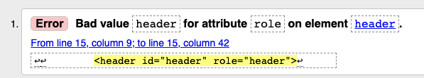

# Grille d'évaluation pour le TP2
- [X] __Balisage sémantique et structurel__ (4 points)
- [ ] __Stratégie d’intégration complétée__
- [X] __Styles CSS (base)__ (3 points)
    - charte typographique responsive
    - rangées 3-4-5-7-8
- [X] __Styles CSS (défis du header et du footer)__ (.85/1 point)
    - rangées 1-2-6
- [X] __Versionnage__ (1 point)
- [X] __Mise en ligne sur Github Pages__ (1 point)

## Note et commentaires
 9.85/10 

Excellent travail d'intégration. C'est fait avec un grand souci des détails.
- Ne garder dans le répertoire racine Web QUE les fichiers utiles.
### html
- Une seule erreur html : le role d'un header est "banner"

### css
- Le style du menu actif "Artistes" n'est pas défini.
La classe `nav__liste-lien--active` est utilisée mais n'est pas définie. 
- Pour l'*architecture* des CSS
  - importer ou linker le fichier "normalize" plutôt que de copier-coller
  - rapporter dans la table des matières les subdivisions ajoutées en commentaires 

## Barème
| Barème | sur 1 |
|--------|-------|
| A+     | 1     |
| A      | 0.95  |
| B+     | 0.9   |
| B      | 0.85  |
| C+     | 0.8   |
| C      | 0.75  |
| D      | 0.65  |
